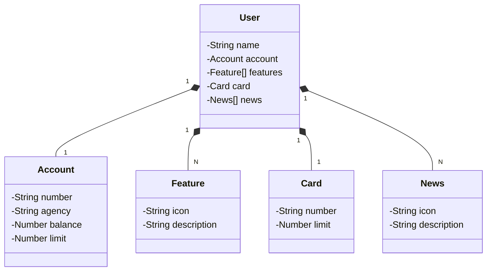

## Java RESTFul API criada para a Santander Java Back End 2024

### Json criado a partir da interface do Figma
```
{
  "classes": {
    "User": {
      "attributes": {
        "name": "String",
        "account": "Account",
        "features": "Feature[]",
        "card": "Card",
        "news": "News[]"
      },
      "relationships": {
        "Account": {
          "type": "composition",
          "multiplicity": "1"
        },
        "Feature": {
          "type": "composition",
          "multiplicity": "N"
        },
        "Card": {
          "type": "composition",
          "multiplicity": "1"
        },
        "News": {
          "type": "composition",
          "multiplicity": "N"
        }
      }
    },
    "Account": {
      "attributes": {
        "number": "String",
        "agency": "String",
        "balance": "Number",
        "limit": "Number"
      }
    },
    "Feature": {
      "attributes": {
        "icon": "String",
        "description": "String"
      }
    },
    "Card": {
      "attributes": {
        "number": "String",
        "limit": "Number"
      }
    },
    "News": {
      "attributes": {
        "icon": "String",
        "description": "String"
      }
    }
  },
  "relationships": [
    {
      "source": "User",
      "target": "Account",
      "type": "composition",
      "multiplicity": "1"
    },
    {
      "source": "User",
      "target": "Feature",
      "type": "composition",
      "multiplicity": "N"
    },
    {
      "source": "User",
      "target": "Card",
      "type": "composition",
      "multiplicity": "1"
    },
    {
      "source": "User",
      "target": "News",
      "type": "composition",
      "multiplicity": "N"
    }
  ]
}


```

### Diagrama Mermaid criada a partir do arquivo Json


